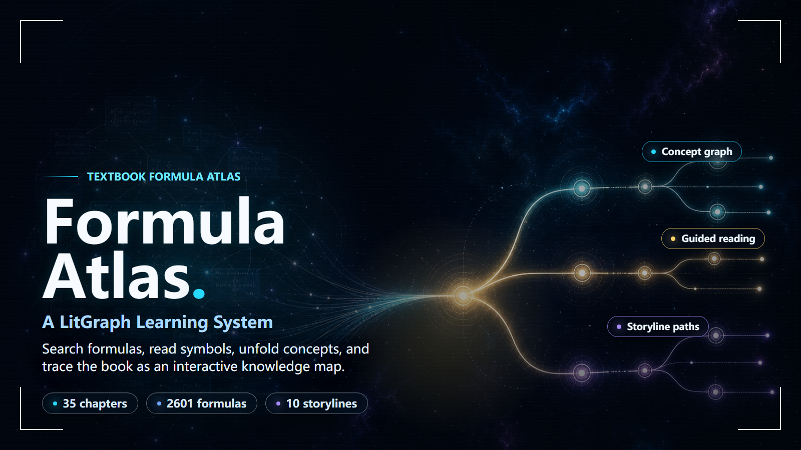
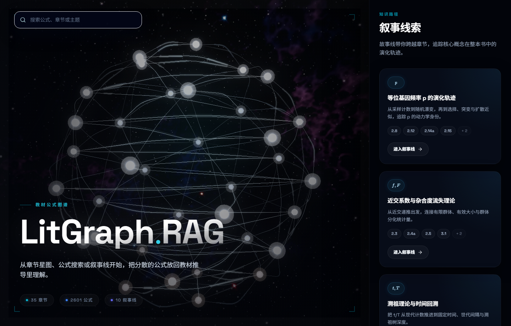
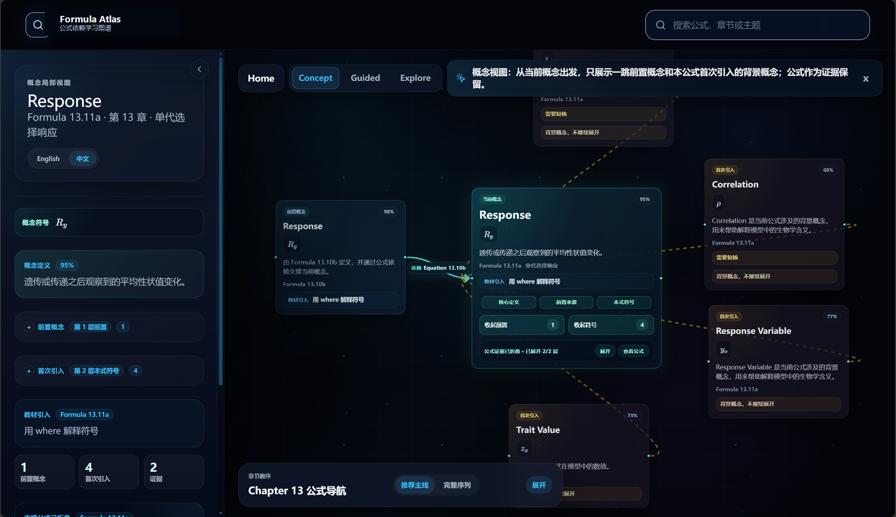
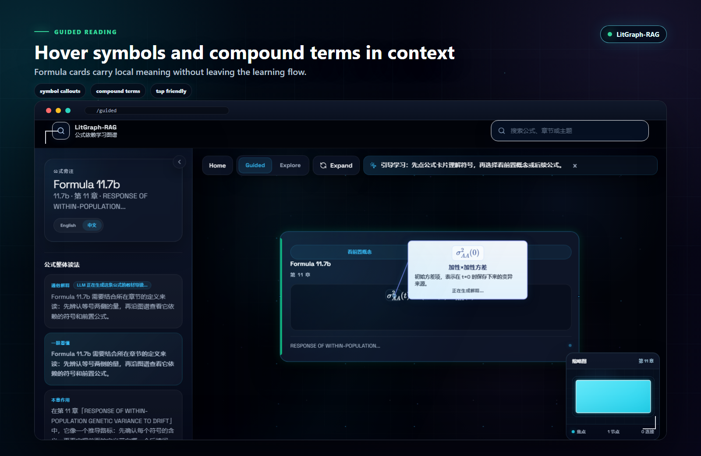
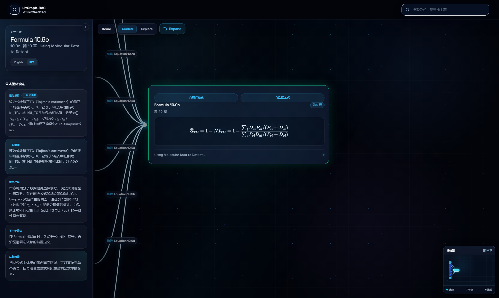
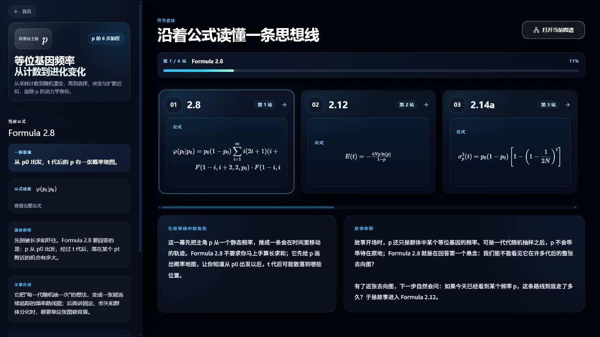

<p align="center">
  
</p>

<h1 align="center">Knowstellation</h1>

<p align="center">
  <strong>Navigable Knowledge Constellations for Books and Papers</strong>
  <br>
  Transform dense books and research papers into a navigable knowledge star structure.
  Search formulas, read symbols, unfold concepts, and move through the source as an interactive constellation.
</p>

<p align="center">
  <a href="https://knowstellation.13260051624.workers.dev/"><strong>Live demo</strong></a>
  |
  <a href="#quick-start"><strong>Quick start</strong></a>
  |
  <a href="#product-tour"><strong>Product tour</strong></a>
  |
  <a href="#verification"><strong>Verification</strong></a>
  |
  <a href="#deployment-notes"><strong>Deploy</strong></a>
</p>

<p align="center">
  <a href="https://react.dev/"></a>
  <a href="https://vite.dev/"></a>
  <a href="https://www.typescriptlang.org/"></a>
  <a href="#verification"></a>
  <a href="#llm-configuration"></a>
  <a href="LICENSE"></a>
</p>

Knowstellation turns dense source material into an explorable knowledge constellation. It starts with math-heavy textbooks today and is designed around the broader goal of converting books and papers into navigable structures: learners can search a formula, inspect its symbols, unfold prerequisites step by step, read concept definitions in layers, and follow storyline paths through the source instead of getting lost in a linear page sequence.

Live demo: [https://knowstellation.13260051624.workers.dev/](https://knowstellation.13260051624.workers.dev/)

## Why Knowstellation

Books and papers are usually written as linear pages, but their ideas are not linear. Knowstellation treats a source as a sky of connected knowledge stars: formulas, symbols, concepts, prerequisites, citations, and narrative routes become visible nodes that learners can navigate. The current release focuses on formula-heavy textbook material, while the product direction is broader: turn dense academic sources into inspectable, searchable, source-backed constellations.

The project is intentionally strict about graph quality. Exact references, exact or canonical symbol matches, compound formula groups, and explicit text definitions can enter the main graph. Family-only symbol matches stay as ambiguous audit candidates instead of becoming accepted prerequisite edges.

## Highlights

- **Knowledge constellation reading**: dense chapters become connected stars of formulas, concepts, prerequisites, and source-backed evidence.
- **Formula-first graph reading**: Guided mode combines step-by-step expansion with symbol callouts; Explore opens the chapter-scale graph.
- **Chapter star map**: each chapter opens as a navigable constellation of formulas and recommended entry points.
- **Inline symbol annotations**: hover, focus, or tap symbols and compound groups inside a rendered formula to see compact semantic labels. Runtime LaTeX scanning fills gaps when the offline symbol index misses local variables.
- **Layered concept graph**: Concept mode starts from the concept defined by the current formula, reveals prerequisite and introduced concepts in controlled layers, keeps formula evidence folded by default, and lets learners drag concept cards apart when arranging a dense local view.
- **Storyline learning paths**: curated narrative routes connect formulas that share a mathematical idea.
- **Conservative dependency builder**: keeps operator pollution, family-only matches, and fallback definitions out of the accepted graph.
- **LLM-assisted explanations**: optional server-side proxy enriches chapter summaries and symbol explanations without exposing API keys in the browser.

## Product Tour

### Home star map

Start from the whole book instead of a blank search box. The home view turns chapters, formulas, and curated routes into a navigable constellation, so learners can enter by chapter, formula, or storyline.

<p align="center">
  
</p>

### Concept graph reading

Concept mode answers the question "what is this source passage defining?" before asking the learner to chase every dependency. It starts from the current concept, reveals one prerequisite layer by default, keeps formula evidence folded until it is requested, and exposes introduced symbols as draggable cards. This makes dense local concept neighborhoods readable instead of dropping the whole graph at once.

<p align="center">
  
</p>

### Guided formula reading

Guided mode keeps the learner inside a single formula card first. Hover or tap highlighted terms to see compact semantic notes, then unfold prerequisites or successors when the formula is ready to connect. The left panel keeps the full-formula reading concise: one quick takeaway plus the formula's role in the chapter.

<p align="center">
  
</p>

### Formula dependency map

Explore mode opens the chapter-scale dependency map. It is designed for orientation rather than close reading: drag across the chapter, zoom through formula clusters, and use the minimap to keep the current focus visible while scanning the larger structure.

<p align="center">
  
</p>

### Storyline paths

Storylines turn scattered formulas into a readable sequence. Each route explains why the current formula matters, what came before, and which graph view to open next.

<p align="center">
  
</p>

## Demo Flow

```text
Home star map -> Chapter entry point -> Guided formula graph
               -> Inline symbol reading
               -> Concept graph explanation
               -> Explore full chapter graph
               -> Storyline path review
```

The UI is optimized around the current reading model:

| Mode | Purpose |
| --- | --- |
| `guided` | Default study flow. Expand prerequisites and successors gradually while reading symbol-level callouts in the formula card. |
| `concept` | Layered concept view. Start from the formula's defined concept, reveal prerequisite/introduced concept layers, and drag cards to arrange dense neighborhoods. |
| `explore` | Full chapter overview for browsing the formula network. |

## Quick Start

Requirements:

- Node.js 20 or newer
- Python 3.10 or newer
- npm

Install dependencies:

```powershell
npm install
pip install -r requirements.txt
```

Run the local app:

```powershell
npm run dev
```

Open:

```text
http://127.0.0.1:5173/
```

Build for production:

```powershell
npm run build
```

Preview the production build:

```powershell
npm run preview
```

## LLM Configuration

LLM features are optional. The frontend calls `/api/llm`; secrets stay on the server.

Create `.env.local` from `.env.example`:

```powershell
Copy-Item .env.example .env.local
```

Then fill in `.env.local`:

```dotenv
DEEPSEEK_API_KEY=
DEEPSEEK_API_BASE=https://api.deepseek.com
```

Do not expose provider keys through `VITE_*` variables. When the proxy is unavailable, the app falls back to local textbook explanations.

## Data Pipeline

Build all frontend dependency data:

```powershell
python scripts\build_dependencies.py --all
```

Sync generated data into `public/data`:

```powershell
npm run sync:data
```

Audit graph quality:

```powershell
npm run audit:graph
```

Expected high-level audit invariants for the conservative graph:

- `family_candidate_prerequisites` is `0`
- `nonaccepted_prerequisites` is `0`
- `fallback_definitions` is `0`
- `operator_pollution_chapters` is empty

## Symbol Sense Workflow

Symbol Sense exports prompts for external LLM review, imports validated results, and converts them into frontend-ready dependency data.

```powershell
npm run symbol-sense -- export-prompts
npm run symbol-sense -- import-results --chapter chapter6 --input path\to\raw.json
npm run symbol-sense -- convert --chapter chapter6
```

Intermediate files live under `data/frontend/symbol_sense/`. Conversion updates `data/frontend/dependency`; run `npm run sync:data` before publishing those changes to the frontend.

## Project Structure

```text
api/                     Serverless LLM proxy
data/frontend/           Generated frontend data before publishing
docs/                    Design notes and implementation prep
public/data/             Static data served by Vite
scripts/                 Dependency, audit, and Symbol Sense tools
src/
  components/GraphView/  Formula graph canvas, nodes, controls
  components/StarField/  Three.js chapter/formula star maps
  components/SearchBar/  Search UI and worker
  pages/                 Home, chapter, storyline, graph pages
  services/              LLM client
  utils/                 Formula, symbol, navigation helpers
test/                    Node and Python tests
```

## Scripts

| Command | What it does |
| --- | --- |
| `npm run dev` | Start Vite on `127.0.0.1`. |
| `npm run build` | Type-check and build production assets. |
| `npm run preview` | Preview the production build locally. |
| `npm run test:node` | Run TypeScript/Node tests. |
| `npm run test:python` | Run Python pipeline tests. |
| `npm run test:e2e` | Run Playwright browser interaction tests. |
| `npm run sync:data` | Copy generated data into `public/data`. |
| `npm run audit:graph` | Audit dependency graph quality. |
| `npm run symbol-sense` | Export/import/convert Symbol Sense review data. |

## Verification

Before opening a PR or deploying:

```powershell
npm run test:node
npm run test:python
npm run test:e2e
npm run build
```

### Manual QA Checklist

For frontend checks, manually verify:

- `/` on desktop and mobile landscape widths
- `/chapter/<chapterId>` from the home star map
- search result navigation into a formula graph
- `/graph/<formulaId>?chapterId=<chapterId>&mode=guided` symbol hover/tap callouts, including indexed symbols such as `d_s` / `p_s`
- fraction annotations: hover the fraction bar or surrounding fraction body for the whole-ratio meaning, then hover numerator/denominator symbols for their own labels
- concept view for a formula with several prerequisites: verify one concept layer opens by default, formula evidence stays folded, concept cards do not overlap, and cards can be dragged
- `/graph/chapter/<chapterId>?mode=explore` minimap node selection
- `/storyline/<storylineId>` and its "open graph" path

## Deployment Notes

- Deploy the Vite frontend as static assets.
- Deploy `api/llm.js` or an equivalent server-side route at `/api/llm`.
- Configure `DEEPSEEK_API_KEY` and `DEEPSEEK_API_BASE` only in the server environment.
- Keep `public/data` in sync with the latest generated data.
- Run `npm run audit:graph` before publishing a new textbook or chapter batch.
- Keep the generated screenshots under `public/assets/readme` current when the visual design changes.
- The UI includes user-readable fallbacks for data loading, LLM proxy failure, and WebGL initialization failure; check those paths before a public deployment.

## Documentation

- [Design and optimization notes](docs/design-and-optimization.md)
- [Symbol annotation implementation prep](docs/implementation-prep.md)

## Roadmap

- Move more Guided symbol annotations from runtime LLM calls into offline JSON.
- Add richer graph QA reports for ambiguous and rejected edges.
- Validate zero-code textbook transfer on a second book.

## Contributing

Issues and pull requests are welcome. For graph-related changes, include the audit output or describe why the accepted-edge invariants still hold. For UI changes, include the routes and viewport sizes you checked.

## License

Knowstellation is licensed under the [MIT License](LICENSE).
